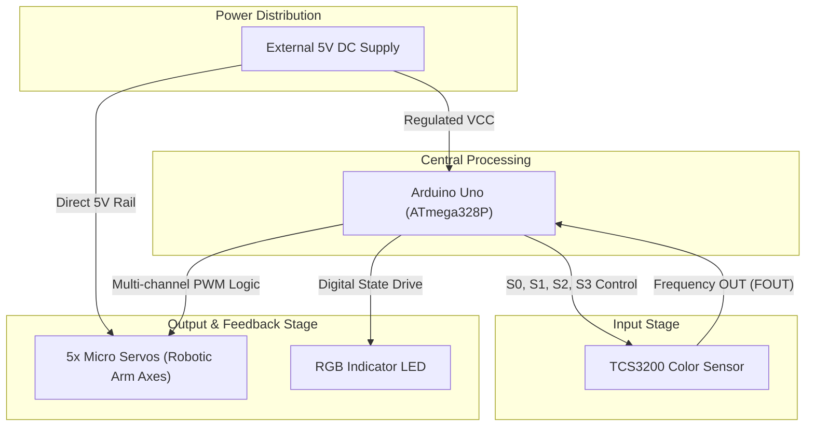

# Arduino Color Sorter + Robotic Arm


## Executive Overview
This project implements an automated pick-and-place mechatronic system utilizing an Arduino Uno. The system combines an articulated robotic arm—actuated by 5 micro servos—with a **TCS3200 color sensor** to automatically detect, classify, and sort colored objects. When an object is placed at the sensing station, the system reads the RGB frequency components. Once a valid color threshold is matched, the corresponding indicator LED illuminates, and the robotic arm initiates a pre-programmed kinematic sequence to grasp, move, and release the object into a designated sorting zone.

> [!WARNING]
> **CRITICAL POWER DISTRIBUTION HAZARD**
> Driving 5 micro servos simultaneously requires a significant current draw that exceeds the 500mA limitation of the Arduino Uno's onboard 5V linear voltage regulator. You MUST use an external, dedicated 5V power supply (e.g., 5V 3A+ SMPS) to power the servos. Failure to do so will result in brownout resets, erratic robotic arm jitter, and potential damage to the microcontroller. The grounds between the external supply and the Arduino must be tied together.

## Feature Highlights
- **RGB Frequency Sorting**: High-speed object color detection utilizing the TCS3200 photodiode array.
- **5-DOF Robotic Articulation**: Pre-programmed Cartesian sorting sequences via 5 micro servos.
- **Visual Classification Indicators**: LED status board indicating real-time system decisions (Red, Yellow/Green, Blue).
- **Automated Kinematics**: Timed claw gripping, lifting, rotation, and deployment logic.

## System Architecture



## Theoretical & Mathematical Models

### TCS3200 Color Frequency Scaling

The TCS3200 sensor consists of an $8 \times 8$ array of photodiodes with red, green, blue, and clear filters. The internal oscillator converts the light intensity into a square wave output. The output frequency ($f_{\text{out}}$) is directly proportional to the incident irradiance ($E_e$):

$$f_{\text{out}} \propto E_e$$

To optimize the frequency output for the Arduino's `pulseIn()` timing resolution, the firmware statically scales the output frequency to 20% by setting the logic pins:
- $S_0 = \text{HIGH}$
- $S_1 = \text{LOW}$

### Servo Kinematic Actuation
A standard hobby servo interprets a 50Hz (20ms period) PWM signal. The rotational angle $\theta $ is proportional to the pulse width$t_p$:
- $t_p = 1.0 \text{ ms} \rightarrow \theta = 0^\circ$
- $t_p = 1.5 \text{ ms} \rightarrow \theta = 90^\circ$
- $t_p = 2.0 \text{ ms} \rightarrow \theta = 180^\circ$

## Hardware Bill of Materials (BOM)
| Component | Specification | Quantity |
| :--- | :--- | :--- |
| Microcontroller | Arduino Uno R3 | 1 |
| Color Sensor | TCS3200 Programmable Color Light-to-Frequency Converter | 1 |
| Actuators | SG90 / MG90S Micro Servos | 5 |
| Visual Indicators | 5mm LEDs (Red, Yellow, Blue) | 3 |
| Resistors | 220Ω / 330Ω Current Limiting | 3 |
| Power Supply | 5V 3A+ External Source | 1 |

## Complete Pinout / Wiring Matrix Table

| Component | Terminal / Function | Arduino Pin | Notes |
| :--- | :--- | :--- | :--- |
| **TCS3200 Color Sensor** | S0 | D4 | Frequency scaling (High) |
| | S1 | D5 | Frequency scaling (Low) = 20% |
| | S2 | D6 | Color filter selection |
| | S3 | D7 | Color filter selection |
| | OUT | D8 | Frequency output read by `pulseIn()` |
| | VCC / GND | 5V / GND | Sensor logic power |
| **Micro Servos** | Base / Arm 1 | D9 | Base rotation / Primary arm |
| | Arm 2 | D10 | Secondary joint |
| | Arm 3 | D11 | Tertiary joint |
| | Claw 1 | D12 | Claw mechanism |
| | Claw 2 | D13 | Claw mechanism |
| **Indicator LEDs** | Red LED | A0 | Triggers on red block |
| | Yellow LED | A1 | Triggers on yellow/green block |
| | Blue LED | A2 | Triggers on blue block |

## Repository Layout Tree
```text
.
├── docs/                  # Project reports and legacy documentation
│   └── images/            # Original hardware captures
├── firmware/              # Extracted and verified color sorting Arduino code
├── hardware/              # Pinout matrices and wiring definitions
└── _archive_unrelated/    # Unused academic files
```

## Step-by-Step Firmware Setup & Prerequisites
1. Download and install the [Arduino IDE](https://www.arduino.cc/en/software).
2. Open the project firmware at `firmware/color_sorter.ino`.
3. The code relies on the built-in `<Servo.h>` library; no external libraries are required.
4. Ensure your external 5V power supply is turned on before engaging the Arduino to prevent sudden inrush currents from dropping the logic voltage.
5. Compile and upload to the **Arduino Uno**.

## Authentic Documentation & Historical Asset Links
- **Historical Report**: [`docs/A project of a color sorter with Arduino and arm robotic.docx`](docs/)
- **Hardware Captures**: [`docs/images/`](docs/images/)
- **Evidence Classification**: The firmware code is officially **[VERIFIED]** as it was successfully extracted verbatim from the original academic PDF report, maintaining historical authenticity in delays and logic parameters.

## Engineering Audit & Defensibility Limitations
- **Open-Loop Control**: Standard micro servos operate in an open-loop configuration relative to the microcontroller. The system relies entirely on hard-coded time delays (`delay(2000);`) to assume the arm has reached its target position before actuating the claw.
- **Ambient Light Interference**: The TCS3200 is highly susceptible to ambient lighting changes. Without a shrouded scanning bay, external shadows or sunlight will dramatically shift the calibrated RGB frequency thresholds, resulting in mis-sorting errors.

---

**Hassan Moqbel Morshed Ghaleb**
Mechatronics Engineer | Mechanical Design & CAD (SolidWorks & AutoCAD) | Preventive Maintenance & Electromechanical Systems | Industrial Automation, Control Systems, Robotics & Intelligent Machines | CAD/FEA, Embedded Systems, Python & C++
[GitHub](https://github.com/Hassan-Moqbel) · [Facebook](https://www.facebook.com/share/1BqxAgVjHi/) · [LinkedIn](https://www.linkedin.com/in/hassan-moqbel)

## License
This project is licensed under the [GPL-2.0 License](LICENSE).
